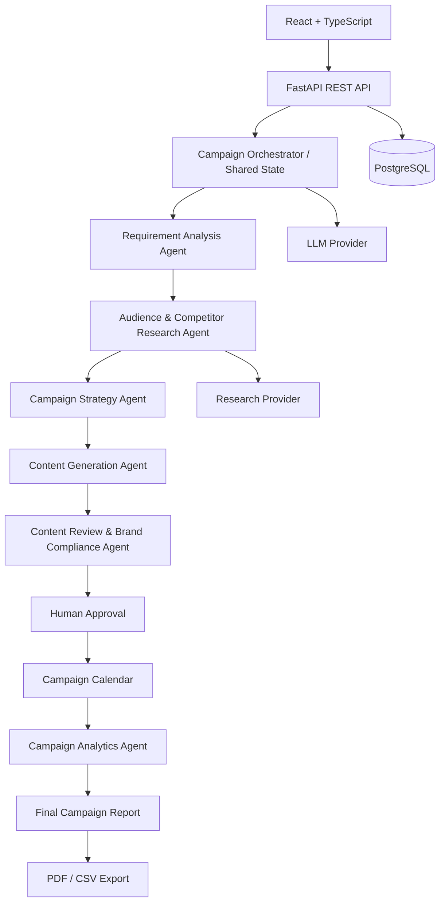

# System Architecture

```mermaid
flowchart TD
 UI[React + TypeScript] --> API[FastAPI REST API]
 API --> ORCH[Campaign Orchestrator / Shared State]
 ORCH --> A1[Requirement Analysis Agent]
 A1 --> A2[Audience & Competitor Research Agent]
 A2 --> A3[Campaign Strategy Agent]
 A3 --> A4[Content Generation Agent]
 A4 --> A5[Content Review & Brand Compliance Agent]
 A5 --> HUMAN[Human Approval]
 HUMAN --> CAL[Campaign Calendar]
 CAL --> A6[Campaign Analytics Agent]
 A6 --> REPORT[Final Campaign Report]
 ORCH --> LLM[LLM Provider]
 A2 --> WEB[Research Provider]
 API --> DB[(PostgreSQL)]
 REPORT --> EXP[PDF / CSV Export]
```

See `architecture.svg` for the visual version.
